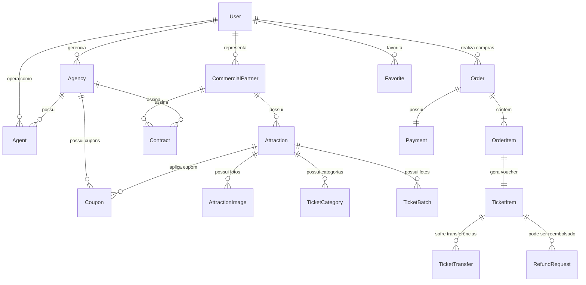

# 03 — Modelagem do Banco de Dados: Curitiba 360

## 1. Visão Geral do Modelo de Dados
O modelo de dados do **Curitiba 360** foi projetado para suportar alta concorrência na venda de ingressos, controle rigoroso de estoque por lotes, rastreabilidade financeira e auditoria integral em conformidade com as regras de negócio e a LGPD.

---

## 2. Diagrama Entidade-Relacionamento (Conceitual)

---

## 3. Principais Entidades e Dicionário de Dados

### 3.1 `users` (Usuários do Sistema e Portal)
Armazena todos os usuários (administradores, operadores, turistas, parceiros e agentes).
- `id` (UUID, PK)
- `name` (VARCHAR(150), Not Null)
- `email` (VARCHAR(150), Unique, Not Null)
- `password_hash` (VARCHAR(255), Nullable para login Google OAuth)
- `cpf` (VARCHAR(14), Unique, Nullable para estrangeiros)
- `phone` (VARCHAR(20), Nullable)
- `role` (ENUM: `ADMIN`, `PARTNER`, `EDITOR`, `READER`, `AGENCY`, `AGENT`, `TOURIST`, Not Null)
- `is_active` (BOOLEAN, Default: true)
- `email_verified_at` (TIMESTAMP, Nullable)
- `google_id` (VARCHAR(100), Unique, Nullable)
- `created_at` / `updated_at` (TIMESTAMP)

### 3.2 `commercial_partners` (Parceiros Comerciais / Donos de Atrações)
- `id` (UUID, PK)
- `user_id` (UUID, FK -> users)
- `company_name` (Razão Social, VARCHAR(200), Not Null)
- `trade_name` (Nome Fantasia, VARCHAR(200))
- `cnpj` (VARCHAR(18), Unique, Not Null)
- `status` (ENUM: `PENDING_APPROVAL`, `ACTIVE`, `SUSPENDED`, `REJECTED`, Default: `PENDING_APPROVAL`)
- `bank_name`, `bank_agency`, `bank_account`, `pix_key`
- `ga4_measurement_id` (VARCHAR(50), Nullable - Integração Analytics)
- `created_at` / `updated_at` (TIMESTAMP)

### 3.3 `agencies` & `agents` (Agências e Agentes de Turismo)
- `agencies`:
  - `id` (UUID, PK), `user_id` (UUID, FK -> users)
  - `company_name`, `trade_name`, `cnpj`, `cadastur` (Registro Embratur)
  - `commission_rate` (DECIMAL(5,2), ex: 10.00%)
  - `status` (ENUM: `WAITING_CONTRACT`, `ACTIVE`, `SUSPENDED`)
- `agents`:
  - `id` (UUID, PK), `agency_id` (UUID, FK -> agencies), `user_id` (UUID, FK -> users)
  - `status` (ENUM: `ACTIVE`, `INACTIVE`)
  - `commission_split_rate` (DECIMAL(5,2))

### 3.4 `attractions` (Atrações e Pontos Turísticos)
- `id` (UUID, PK)
- `partner_id` (UUID, FK -> commercial_partners, Nullable para pontos públicos mantidos pela prefeitura)
- `name` (VARCHAR(200), Not Null)
- `slug` (VARCHAR(220), Unique, Not Null)
- `summary` (TEXT, Not Null - resumo para cards da vitrine)
- `description` (TEXT, Not Null - descrição completa com regras de visita)
- `category` (ENUM: `PARQUE`, `MUSEU`, `GASTRONOMIA`, `SHOW`, `PASSEIO`, `HISTORICO`)
- `address`, `neighborhood`, `city`, `state`, `zip_code`
- `latitude` (DECIMAL(10,8)), `longitude` (DECIMAL(11,8))
- `cover_image_url` (VARCHAR(500))
- `is_active` (BOOLEAN, Default: true)
- `is_featured` (BOOLEAN, Default: false - "Imperdíveis")
- `google_place_id` (VARCHAR(100), Nullable)
- `google_rating` (DECIMAL(3,2), Default: 0)

### 3.5 `ticket_categories` & `ticket_batches` (Lotes e Ingressos)
- `ticket_categories`:
  - `id` (UUID, PK), `attraction_id` (UUID, FK -> attractions)
  - `name` (VARCHAR(100), ex: "Inteira", "Meia-Entrada Estudante", "Morador de Curitiba", "Cortesia")
  - `requires_document_proof` (BOOLEAN, Default: false)
- `ticket_batches` (Lotes):
  - `id` (UUID, PK), `ticket_category_id` (UUID, FK -> ticket_categories)
  - `name` (VARCHAR(50), ex: "1º Lote", "Lote Promocional")
  - `price` (DECIMAL(10,2), Not Null)
  - `original_price` (DECIMAL(10,2), Preço de tabela para cálculo de desconto)
  - `total_quantity` (INT, Not Null)
  - `available_quantity` (INT, Not Null)
  - `start_date` / `end_date` (TIMESTAMP)

### 3.6 `orders` & `order_items` & `ticket_items` (Compras e Vouchers)
- `orders`:
  - `id` (UUID, PK), `code` (VARCHAR(20), Unique, ex: "CWB-2026-89421")
  - `user_id` (UUID, FK -> users)
  - `subtotal` (DECIMAL(10,2)), `discount_amount` (DECIMAL(10,2)), `total_amount` (DECIMAL(10,2))
  - `status` (ENUM: `PENDING`, `PAID`, `CANCELLED`, `REFUNDED`)
  - `coupon_id` (UUID, FK -> coupons, Nullable)
  - `created_at` (TIMESTAMP)
- `ticket_items` (O voucher individual gerado com QR Code):
  - `id` (UUID, PK), `order_item_id` (UUID, FK), `attraction_id` (UUID, FK)
  - `voucher_code` (VARCHAR(32), Unique, ex: "VCH-8291-ABCD-7712")
  - `holder_name` (VARCHAR(150)), `holder_document` (VARCHAR(20))
  - `status` (ENUM: `VALID`, `USED`, `CANCELLED`, `TRANSFERRED`)
  - `used_at` (TIMESTAMP, Nullable), `validated_by_user_id` (UUID, FK -> users, Nullable)
  - `visit_date` (DATE, Not Null)

### 3.7 `coupons` (Cupons de Desconto)
- `id` (UUID, PK)
- `code` (VARCHAR(50), Unique, ex: "CURITIBA360", "AGENCIA-VINA-10")
- `discount_type` (ENUM: `PERCENTAGE`, `FIXED`)
- `discount_value` (DECIMAL(10,2))
- `min_purchase_amount` (DECIMAL(10,2), Default: 0)
- `agency_id` (UUID, FK -> agencies, Nullable)
- `max_uses` (INT, Nullable), `used_count` (INT, Default: 0)
- `valid_from` / `valid_until` (TIMESTAMP)
- `is_active` (BOOLEAN, Default: true)

### 3.8 `ticket_transfers` & `anti_scalping` (Controle Anti-Cambismo)
- `ticket_transfers`:
  - `id` (UUID, PK), `ticket_item_id` (UUID, FK)
  - `sender_user_id` (UUID, FK -> users)
  - `recipient_email` (VARCHAR(150)), `recipient_cpf` (VARCHAR(14))
  - `transferred_at` (TIMESTAMP)
- `anti_scalping_rules`:
  - Limite máximo de 2 transferências por voucher.
  - Limite máximo de 6 compras do mesmo evento/dia pelo mesmo CPF dentro do mês.
  - Bloqueio preventivo e auditoria imediata ao detectar padrões suspeitos.

### 3.9 `refund_requests` (Fila de Reembolsos)
- `id` (UUID, PK), `order_id` (UUID, FK), `ticket_item_id` (UUID, FK)
- `user_id` (UUID, FK -> users)
- `reason` (TEXT, Not Null)
- `refund_type` (ENUM: `FULL`, `PARTIAL`)
- `status` (ENUM: `PENDING`, `APPROVED`, `REJECTED`)
- `processed_by_user_id` (UUID, FK -> users)
- `gateway_refund_id` (VARCHAR(100), Nullable)
- `processed_at` (TIMESTAMP, Nullable)
