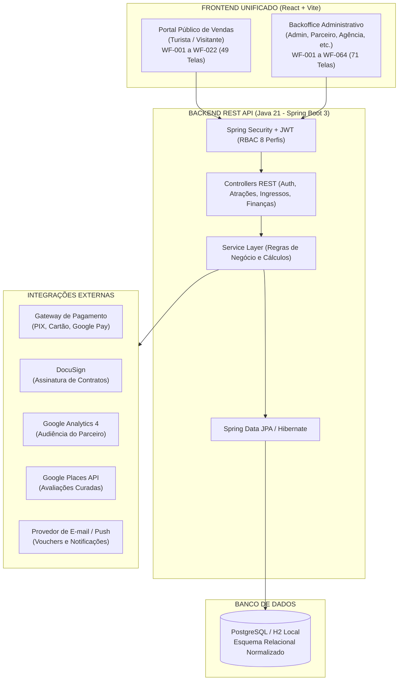

# PLANO MESTRE DE DESENVOLVIMENTO DO CURITIBA 360

> **Documento Oficial de Governança, Arquitetura e Rastreabilidade Técnica**  
> **Base de Referência:** SRS Backoffice (191 págs), SRS Portal Público (134 págs), PJL Curitiba 360 (10 págs) e 120 Wireframes.  
> **Stack:** React 18 (Vite + Tailwind CSS) + Java 21/25 (Spring Boot 3 + Spring Security + Spring Data JPA).

---

## 1. 🏗️ Visão Geral e Arquitetura do Sistema

O sistema **Curitiba 360** é composto por dois ambientes front-end integrados que consomem uma API central robusta desenvolvida em Java Spring Boot:



---

## 2. 👥 Matriz de Perfis de Acesso (RBAC)

O sistema conta com **8 perfis** de usuários rigorosamente tipados:

| Perfil | Escopo e Responsabilidades | Ambiente de Acesso |
|---|---|---|
| **Administrador (`ADMIN`)** | Acesso irrestrito a todos os módulos, aprovação de parceiros/agências, parametrização de taxas, relatórios financeiros globais e controle anti-cambista. | Backoffice + Portal |
| **Parceiro Comercial (`PARTNER`)** | Gestão exclusiva de suas atrações, lotes de ingressos, cupons, relatórios de vendas da sua atração, borderô e integração da sua conta GA4. | Backoffice |
| **Editor (`EDITOR`)** | Manutenção do CMS Institucional, curadoria da Home, banners e textos de atrações. Sem acesso a dados financeiros sensíveis. | Backoffice |
| **Leitor (`READER`)** | Apenas consulta de relatórios e dados cadastrais permitidos. Sem permissão de alteração ou exclusão. | Backoffice |
| **Agência de Turismo (`AGENCY`)** | Gestão de seus agentes vinculados, painel de vendas da agência, cupons dedicados e extrato de comissionamento. | Backoffice |
| **Agente de Turismo (`AGENT`)** | Painel individual de vendas, extrato de suas comissões e emissão de ingressos autorizados. | Backoffice |
| **Turista (`TOURIST`)** | Usuário cadastrado no portal público. Realiza compras, visualiza seus vouchers, solicita reembolso e transfere ingressos. | Portal Público |
| **Visitante (`VISITOR`)** | Usuário anônimo. Consulta vitrine, busca atrações e navega pelo mapa. | Portal Público |

---

## 3. 📋 Rastreabilidade Integral: Módulos, Requisitos (RF), Casos de Uso (CU) e Telas (WF)

### 3.1 Módulos do Backoffice (RF-001 a RF-040 | CU-001 a CU-044 | 71 Telas)

| Módulo | Itens de Menu (Ordem RN-002.02) | Requisitos Funcionais | Casos de Uso | Wireframes Vinculados |
|---|---|---|---|---|
| **MOD-01** | Autenticação | RF-001, RF-005 | CU-001, CU-002, CU-003, CU-005 | `WF-001`, `WF-004` |
| **MOD-02** | 1º Dashboard | RF-003 | CU-004 | `WF-002` |
| **MOD-03** | 2º Gestão de Usuários | RF-006, RF-007 | CU-006, CU-007, CU-044 | `WF-005`, `WF-006` |
| **MOD-04** | 3º Gestão de Parceiros Comerciais | RF-036, RF-037 | CU-038, CU-041 | `WF-058`, `WF-059` |
| **MOD-05** | 4º Gestão de Agências | RF-026, RF-027, RF-029, RF-030 | CU-028, CU-029, CU-031, CU-032 | `WF-048` (E1 a E9), `WF-049` (E1 a E3), `WF-051`, `WF-052` |
| **MOD-06** | 5º Gestão de Agentes | RF-028 | CU-030 | `WF-050`, `WF-064` |
| **MOD-07** | 6º Gestão de Contratos (DocuSign) | RF-008, RF-009 | CU-008 | `WF-007`, `WF-008` |
| **MOD-08** | 7º Configurações Comerciais | RF-010, RF-011 | CU-009, CU-010 | `WF-009`, `WF-010`, `WF-011` |
| **MOD-09** | 8º Gestão de Atrações | RF-012, RF-013, RF-014, RF-020, RF-021, RF-040 | CU-011, CU-012, CU-013, CU-014, CU-015, CU-021, CU-027, CU-039 | `WF-012` a `WF-016`, `WF-026`, `WF-027`, `WF-061`, `WF-062` |
| **MOD-14** | Ingressos e Cupons da Atração | RF-015, RF-016, RF-017, RF-018 | CU-016, CU-017, CU-018, CU-019 | `WF-017` a `WF-024` |
| **MOD-15** | Validação de Ingressos (Catraca) | RF-025 | CU-026 | `WF-031` |
| **MOD-16** | Analytics da Atração (GA4) | RF-019 | CU-020 | `WF-025` |
| **MOD-17** | Gestão Financeira da Atração | RF-022, RF-023, RF-024 | CU-022, CU-023, CU-024, CU-025, CU-040 | `WF-028` a `WF-030`, `WF-032` a `WF-047` |
| **MOD-10** | 9º Fila de Reembolsos | RF-031 | CU-033 | `WF-053` |
| **MOD-11** | 10º Relatórios Financeiros Globais | RF-039 | CU-043 | `WF-063` |
| **MOD-12** | 11º Controle Anti-Cambista | RF-038 | CU-042 | `WF-060` |
| **MOD-13** | 12º Conteúdo (CMS e Curadoria) | RF-032, RF-033 | CU-034, CU-035 | `WF-054`, `WF-055` |
| **MOD-14** | 13º Central de Notificações | RF-034, RF-035 | CU-036 | `WF-056` |

---

### 3.2 Módulos do Portal Público (RF-041 a RF-062 | CU-045 a CU-082 | 49 Telas)

| Módulo do Portal | Funcionalidades Principais | Requisitos | Casos de Uso | Wireframes Vinculados |
|---|---|---|---|---|
| **Vitrine & Home** | Carrossel, busca Airbnb, categorias, imperdíveis | RF-041, RF-045, RF-046 | CU-049, CU-052, CU-053 | `WF-002`, `WF-002B`, `WF-005` |
| **Autenticação Turista** | Login e-mail, Google OAuth 2.0, cadastro com CPF, recuperação de senha | RF-042, RF-043, RF-044 | CU-045, CU-046, CU-047, CU-048 | `WF-001`, `WF-001A-C`, `WF-003`, `WF-003A-B` |
| **Experiências & Detalhes**| Galeria em tela cheia, horários, categorias, mapa | RF-047, RF-048 | CU-056, CU-057, CU-058, CU-059 | `WF-007`, `WF-008`, `WF-008A-D`, `WF-009` |
| **Combos & Pacotes** | Vitrine de pacotes de atrações integradas | RF-062 | CU-054 | `WF-006` |
| **Carrinho & Checkout** | Reserva de estoque por 15 min, cupom, identificação de portadores | RF-049, RF-050 | CU-060, CU-061, CU-062, CU-063 | `WF-010`, `WF-011` |
| **Pagamentos** | Cartão de Crédito, PIX Dinâmico, Google Pay | RF-051, RF-052, RF-053 | CU-064, CU-065, CU-066 | `WF-012`, `WF-012A`, `WF-012B` |
| **Voucher & Pedido** | Tela de confirmação, download de PDF, QR Code | RF-054 | CU-067 | `WF-013` |
| **Área do Turista** | Meus Ingressos, Meus Favoritos | RF-055, RF-058 | CU-055, CU-068 | `WF-014`, `WF-015`, `WF-016` |
| **Transferência Anti-Cambista** | Envio de voucher a outro CPF com trava de segurança | RF-056 | CU-071 | `WF-017`, `WF-018` |
| **Reembolsos do Turista**| Solicitação de cancelamento no prazo legal de 7 dias | RF-057 | CU-072 | `WF-019` |
| **Credenciamento B2B** | Auto-cadastro em 3 etapas de Parceiros e Agências | RF-059, RF-060 | CU-073, CU-074 | `WF-004A` (E1 a C), `WF-004B` (E1 a C) |
| **Suporte & Institucional**| Termos de Uso, Privacidade LGPD, FAQ categorizado, Seletor PT/EN | RF-061, RF-063, RF-064, RF-065, RF-066 | CU-050, CU-051, CU-075 a CU-082 | `WF-020`, `WF-021`, `WF-022` |

---

## 4. 🔄 Fluxos de Negócio Críticos

### 4.1 Fluxo de Compra e Emissão de Voucher com QR Code
1. Turista seleciona a atração e data da visita;
2. Seleciona as categorias (`Inteira`, `Meia-Entrada`, `Morador de Curitiba`);
3. Ao adicionar ao carrinho, o sistema aplica um **lock temporário de estoque de 15 minutos** no lote correspondente (`RN-049.01`);
4. No checkout, aplica cupom de desconto (se houver) e escolhe o meio de pagamento:
   - **PIX:** Gera payload dinâmico com expiração de 15 minutos;
   - **Cartão:** Validação com split e tokenização segura;
5. Pagamento confirmado via webhook do Gateway:
   - Gera o registro `Order` com status `PAID`;
   - Gera os registros individuais `TicketItem` contendo: `voucherCode` criptográfico único, `holderName`, `visitDate` e payload para renderização de QR Code;
   - Dispara e-mail transacional com os vouchers em até 2 minutos (`SLA RN-034.08`).

### 4.2 Fluxo de Validação de Ingresso na Catraca (WF-031)
1. O validador da atração abre a tela `/backoffice/validacao` em celular, tablet ou computador;
2. Aponta a câmera para o QR Code do voucher ou digita o código `VCH-...`;
3. A API Java valida:
   - O voucher existe?
   - Pertence à atração correta?
   - A data da visita é válida?
   - O status é `VALID`?
4. **Se válido:** Status muda atomicamente para `USED`, registra `usedAt`, operador responsável e emite sinal sonoro/visual verde de liberação de catraca;
5. **Se já utilizado:** Alerta vermelho imediato informando data e horário da primeira utilização (prevenção contra duplicidade/fraude);
6. **Se cancelado:** Alerta informando cancelamento ou estorno.

### 4.3 Fluxo Anti-Cambista (RN-038 e RF-056)
- Cada voucher individual só pode ser transferido no máximo **2 vezes**;
- Limite máximo de compra de **6 ingressos** para a mesma atração/sessão por CPF no mesmo mês;
- Painel Anti-Cambista (`WF-060`) monitora volumetria atípica por CPF em tempo real, permitindo ao Administrador realizar **bloqueio preventivo manual**.

### 4.4 Fluxo de Comissionamento de Agências e Repasses (WF-051 / WF-052 / WF-024)
- Cada venda originada por cupom ou link de agência/agente registra a respectiva taxa contratual acordada (ex: 10% a 12%);
- No fechamento do período, o sistema calcula o demonstrativo consolidado:
  $$\text{Comissão Devida} = \sum (\text{Valor dos Ingressos Válidos} \times \% \text{Comissão})$$
- A plataforma gera o lote de repasse financeiro via PIX/TED para a conta cadastrada da agência;
- Permite contestação formal e histórico auditável.

---

## 5. 🚀 Roteiro de Execução em 10 Fases Estruturadas

Para garantir que o desenvolvimento das mais de 100 telas transcorra com perfeição e sem retrabalho, seguimos esta sequência:

```text
FASE 01: Arquitetura, Requisitos & Governança (CONCLUÍDA)
  └─ Especificações, modelos ER, mapa de 120 telas e regras rígidas.

FASE 02: Fundação do Backend Java Spring Boot & Banco de Dados (CONCLUÍDA)
  └─ Modelos JPA, Security JWT, Repositories, Controllers base e Seeds iniciais.

FASE 03: Fundação do Frontend React, Design System & Layouts (CONCLUÍDA)
  └─ Vite, Tailwind v4, PortalLayout, BackofficeLayout (menu 14 itens) e Contexts.

FASE 04: Módulo de Parceiros, Agências & Contratos DocuSign (CONCLUÍDA)
  └─ Gestão de Parceiros (WF-058/059), Wizard de Agências em 3 etapas (WF-049),
     Comissionamento (WF-052) e Contratos DocuSign (WF-007/008).

FASE 05: Gestão Completa de Ingressos, Lotes & Cupons (EM ANDAMENTO)
  └─ Cadastro de lotes por categoria (WF-019/020), gestão de cupons de agência
     (WF-021 a 024) e controle rigoroso de estoque com trava de concorrência.

FASE 06: Módulo de Validação de Catraca & QR Code Offline-First
  └─ Refinamento do leitor de câmera com som, feedback sonoro e contingência manual.

FASE 07: Checkout Completo, Gateway de Pagamento & Emissão de Vouchers
  └─ Integração de PIX dinâmico com polling/webhook e geração do voucher em PDF.

FASE 08: Fila de Reembolsos, Painel Anti-Cambista & Auditoria
  └─ Triagem manual fora do prazo de 7 dias (WF-053) e monitoramento por CPF (WF-060).

FASE 09: Gestão Financeira da Atração, Despesas & Relatórios Globais
  └─ 9 Relatórios consolidados (WF-032 a WF-047 e WF-063) com exportação PDF/Excel.

FASE 10: CMS Institucional, Curadoria da Home & Central de Notificações
  └─ Banners dinâmicos, moderação Google Places e réguas de e-mail/push.
```

---

## 6. 💬 Prompts Mestre para Uso com a IA no VS Code

Para garantir consistência máxima ao solicitar qualquer nova tela ou funcionalidade, utilize este formato padronizado:

```markdown
### PROMPT MESTRE PARA CONSTRUÇÃO DE MÓDULO

Você está desenvolvendo o sistema **Curitiba 360** respeitando rigorosamente:
1. O Documento de Arquitetura em docs/01-arquitetura.md;
2. As Regras do Projeto em docs/05-regras-do-projeto.md;
3. O Plano Mestre em docs/PLANO-MESTRE-CURITIBA360.md.

**TAREFA:**
- Módulo: [Nome do Módulo, ex: Gestão de Ingressos e Lotes]
- Telas / Wireframes: [ex: WF-019, WF-020]
- Requisitos Funcionais: [ex: RF-015, RF-016]
- Casos de Uso: [ex: CU-016, CU-017]
- Regras de Negócio: [ex: RN-015.01 a RN-015.06]

**DIRETRIZES DE IMPLEMENTAÇÃO:**
1. Reaproveite os componentes do Design System existentes em `src/components/ui/` (Button, Input, Card, Badge, Modal);
2. Respeite os campos e comportamentos exatamente como desenhados no wireframe correspondente em `docs/wireframes-backoffice/` ou `docs/wireframes-portal/`;
3. Integre a chamada ao backend em Java Spring Boot através do padrão de controllers e DTOs tipados;
4. Garanta estados de Loading, Sucesso e Erro explicativos em português;
5. Não altere as rotas ou layouts existentes sem autorização prévia.
```
